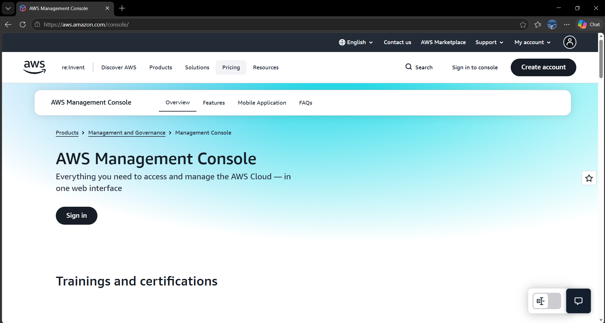

# AWS Research

## Brief Overview

Amazon Web Services (AWS) is a cloud computing platform provided by Amazon. It provides many cloud services that organizations can use to build, deploy, store, and manage applications and data without maintaining all of their own physical infrastructure.

AWS provides services for computing, storage, databases, networking, security, analytics, artificial intelligence, and other cloud workloads.

## Global Infrastructure

AWS has a global infrastructure made up of Regions, Availability Zones, Local Zones, and Wavelength Zones.

An AWS Region is a separate geographic area. Each Region contains multiple Availability Zones. Availability Zones are isolated locations designed to improve application availability and fault tolerance.

Organizations can select an AWS Region based on factors such as location, latency, compliance, and service availability.

## Cloud Management Console

The AWS Management Console is a web-based interface used to access and manage AWS services.

Users can use the console to create resources, configure services, monitor applications, manage accounts, view billing information, and access different AWS services.

### Screenshot

*Figure 1. AWS official homepage or management console.*

## Four Core Services

### 1. Amazon EC2

Amazon Elastic Compute Cloud (EC2) provides virtual servers that organizations can use to run applications and workloads.

### 2. Amazon S3

Amazon Simple Storage Service (S3) provides object storage for files, documents, images, videos, backups, and other data.

### 3. Amazon RDS

Amazon Relational Database Service (RDS) is a managed database service that makes it easier to set up, operate, and scale relational databases.

### 4. Amazon VPC

Amazon Virtual Private Cloud (VPC) allows organizations to create an isolated virtual network where AWS resources can be deployed and controlled.

## Three Advantages

1. **Scalability** – AWS resources can be increased or decreased depending on workload requirements.
2. **Global Infrastructure** – AWS provides cloud infrastructure in many geographic locations around the world.
3. **Large Service Selection** – AWS provides a wide range of services for computing, storage, databases, networking, security, analytics, and other workloads.

## Typical Enterprise Use Cases

AWS is commonly used by enterprises for:

- Web and mobile application hosting
- Data storage and backup
- Database hosting
- E-commerce platforms
- Software development and testing
- Data analytics
- Disaster recovery
- Artificial intelligence and machine learning

## Sources

- AWS Management Console: https://aws.amazon.com/console/
- AWS Global Infrastructure: https://aws.amazon.com/about-aws/global-infrastructure/
- AWS Regions and Availability Zones: https://docs.aws.amazon.com/global-infrastructure/latest/regions/aws-regions-availability-zones.html
- AWS Documentation: https://docs.aws.amazon.com/
