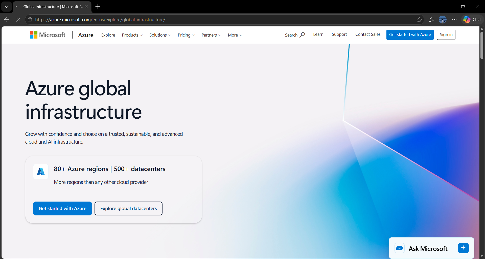

# Microsoft Azure Research

## Brief Overview

Microsoft Azure is a cloud computing platform developed by Microsoft. It provides cloud services that organizations can use to build, deploy, manage, and scale applications and IT infrastructure.

Azure provides services for computing, storage, databases, networking, artificial intelligence, analytics, security, and application development.

## Global Infrastructure

Microsoft Azure has a large global infrastructure consisting of geographic regions and datacenters.

Azure provides many regions around the world, allowing organizations to deploy applications closer to their users. Choosing an appropriate Azure region can help organizations meet latency, availability, data residency, and compliance requirements.

## Cloud Management Console

The Azure Portal is the web-based management console for Microsoft Azure.

Users can use the Azure Portal to create and manage virtual machines, databases, storage accounts, networks, applications, and other Azure resources.

The portal also provides dashboards, monitoring tools, resource management, search, notifications, and cost management features.

### Screenshot

*Figure 1. Microsoft Azure official homepage or management portal.*

## Four Core Services

### 1. Azure Virtual Machines

Azure Virtual Machines provide scalable virtual computers that can run applications, websites, databases, and other workloads.

### 2. Azure Blob Storage

Azure Blob Storage is an object storage service designed for storing large amounts of unstructured data such as documents, images, videos, and backups.

### 3. Azure SQL Database

Azure SQL Database is a managed relational database service based on Microsoft SQL Server technology.

### 4. Azure Virtual Network

Azure Virtual Network allows organizations to create private networks in Azure and securely connect cloud resources.

## Three Advantages

1. **Microsoft Integration** – Azure works well with Microsoft products and technologies such as Windows Server, SQL Server, Microsoft 365, and other Microsoft services.
2. **Global Infrastructure** – Azure provides regions and datacenters around the world.
3. **Enterprise Features** – Azure provides strong tools for security, identity, monitoring, governance, and hybrid cloud environments.

## Typical Enterprise Use Cases

Azure is commonly used by enterprises for:

- Enterprise application hosting
- Windows Server workloads
- Database hosting
- Web application development
- Microsoft-based business applications
- Data analytics
- Artificial intelligence
- Backup and disaster recovery
- Hybrid cloud environments

## Sources

- Azure Global Infrastructure: https://azure.microsoft.com/en-us/explore/global-infrastructure/
- Azure Portal Documentation: https://learn.microsoft.com/en-us/azure/azure-portal/
- Azure Documentation: https://learn.microsoft.com/en-us/azure/
