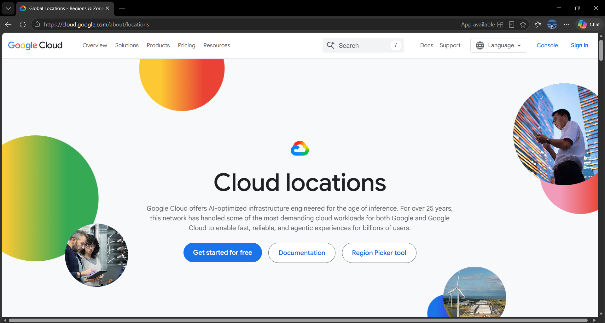

# Google Cloud Platform (GCP) Research

## Brief Overview

Google Cloud Platform (GCP), also called Google Cloud, is a cloud computing platform provided by Google.

It provides cloud services for computing, storage, databases, networking, analytics, artificial intelligence, machine learning, and application development.

Google Cloud is also known for its global network infrastructure and data analytics technologies.

## Global Infrastructure

Google Cloud has a global infrastructure consisting of regions and zones.

A region is a geographic location where Google Cloud resources can be deployed. Regions are divided into zones, which are separate deployment areas within a region.

Organizations can select regions and zones based on latency, availability, performance, and data residency requirements.

Google Cloud currently lists 43 global regions and 130 zones across six continents.

## Cloud Management Console

The Google Cloud Console is a web-based management interface used to manage Google Cloud resources and services.

Users can use the console to create virtual machines, manage storage, configure networks, manage databases, monitor resources, and access other Google Cloud services.

### Screenshot

*Figure 1. Google Cloud official homepage or management console.*

## Four Core Services

### 1. Compute Engine

Google Compute Engine provides virtual machines that can be used to run applications and workloads.

### 2. Cloud Storage

Google Cloud Storage provides scalable object storage for files, backups, media, and other types of data.

### 3. Cloud SQL

Cloud SQL is a fully managed relational database service that supports database systems such as MySQL, PostgreSQL, and SQL Server.

### 4. Virtual Private Cloud (VPC)

Google Cloud VPC provides networking capabilities for connecting and securing cloud resources.

## Three Advantages

1. **Strong Global Network** – Google Cloud uses Google's global network infrastructure to support connectivity and performance.
2. **Data and AI Services** – Google Cloud provides strong services for data analytics, artificial intelligence, and machine learning.
3. **Scalability** – Organizations can scale their cloud resources according to their application requirements.

## Typical Enterprise Use Cases

Google Cloud is commonly used by enterprises for:

- Web application hosting
- Data analytics
- Artificial intelligence and machine learning
- Big data processing
- Database management
- Application development
- Backup and storage
- Global applications
- Kubernetes and container workloads

## Sources

- Google Cloud Locations: https://cloud.google.com/about/locations
- Google Cloud Documentation: https://cloud.google.com/docs
- Google Cloud Console: https://console.cloud.google.com/
